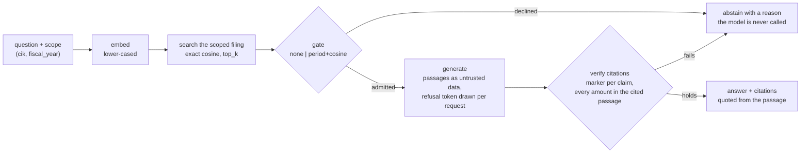

# edgar-rag

Question answering over SEC 10-K filings that cites the passage it used and
declines when the filing does not support an answer.

[](https://github.com/Rodrigo-Palma/edgar-rag/actions/workflows/ci.yml)
· MIT · Runs locally; there is no hosted instance (see [Running it](#running-it)).

## Result

Pre-registered evaluation on 20 companies, 40 filings (fiscal 2024 and 2025),
with one generation per question shared by every arm. False answers are
answers to the 300 unanswerable questions; recall cost is the share of the 180
answerable questions arm A answers correctly and the arm declines.

| arm | false answers on unanswerable (n=300), Wilson 95% | company bootstrap 95% | recall cost (n=180), Wilson 95% | generator s / question |
|---|---|---|---|---|
| A no gate, model refusal only (**default**) | 13/300 = 4.3% [2.5%, 7.3%] | [2.3%, 6.7%] | 0/180 = 0.0% [0.0%, 2.1%] | 13.21 |
| B cosine | 3/300 = 1.0% [0.3%, 2.9%] | [0.0%, 2.3%] | 1/180 = 0.6% [0.1%, 3.1%] | 8.24 |
| C relevance model (brier, removed) | 5/300 = 1.7% [0.7%, 3.8%] | [0.0%, 3.7%] | 3/180 = 1.7% [0.6%, 4.8%] | 9.58 |
| D period guard | 13/300 = 4.3% [2.5%, 7.3%] | [2.3%, 6.7%] | 0/180 = 0.0% [0.0%, 2.1%] | 11.08 |
| E period guard + relevance model (removed) | 5/300 = 1.7% [0.7%, 3.8%] | [0.0%, 3.7%] | 3/180 = 1.7% [0.6%, 4.8%] | 7.62 |
| F period guard + cosine (latency option) | 3/300 = 1.0% [0.3%, 2.9%] | [0.0%, 2.3%] | 1/180 = 0.6% [0.1%, 3.1%] | 6.59 |

20 companies, 15 unanswerable and 9 answerable questions each; cosine and
brier thresholds cross-fitted by company in two folds of 10, at the score that
admits 90% of the answerable questions of the opposite fold. Generator
`qwen3:32b`, `temperature=0`, on an Apple M3 Max, 2026-10-02.

The sentence the [protocol](docs/eval/protocol.md) fixed in advance for this
outcome (section 7), quoted from the [addendum](docs/eval/report-v1-addendum.md):

> With no gate, the model answered 13 of 300 unanswerable questions (FAR 4.3%,
> Wilson 95% [2.5%, 7.3%]). No pre-generation gate can remove more false
> answers than the model gives, so H1 was not attainable on this set. What the
> gate changes is cost: arm F spends 6.59 generator seconds per question
> against 13.21 for arm A, at a recall cost of 0.6% [99% interval +0.0 to
> +2.2 p.p.].

What the two confirmatory comparisons read, copied from the
[report](docs/eval/report-v1.md) (99% company-bootstrap intervals, MDE at 80%
power beside each):

| hypothesis | estimate | 99% CI | MDE | reading |
|---|---|---|---|---|
| H1, FAR(A) - FAR(F), needs lower bound above 5 p.p. | +3.3 p.p. | [+1.3, +5.7] p.p. | about 3.0 p.p. | not attainable: arm A answers 4.3%, under the 5.0% margin |
| H1, recall cost of F, needs upper bound at most 12 p.p. | +0.6 p.p. | [+0.0, +2.2] p.p. | about 1.8 p.p. | |
| H2, FAR(E) - FAR(F), paired, needs upper bound below 0 | +0.7 p.p. | [+0.0, +2.7] p.p. | about 2.2 p.p. | not met; discordant 2 and 0, exact McNemar p = 0.500 |

A difference smaller than the MDE printed beside it is not distinguishable at
this n.

What follows, by the rules of section 9 written before the run:

- **The default gate is `none`.** H1 was not met, so the service asks the model
  every time and leaves the refusal to it. `period+cosine` is offered as a
  latency option: about half the generator seconds per question, at the
  recall cost above.
- **The relevance model was removed.** It ranked worse than cosine on the
  gate-only tier: AUROC(brier) - AUROC(cosine) -0.101, 95% CI [-0.124, -0.080],
  on 3076 answerable and 3076 unanswerable questions of 20 companies. Its
  frozen scores stay in the report ([ADR-0014](docs/adr/0014-remove-brier-default-to-no-gate.md)).

**What this does not show.** The 480 questions are generated from XBRL
templates; the 40 questions written by hand are reported apart
([Evaluation](#evaluation)) and never pooled. The model's refusal is
conservative as well as safe: arm A answered 48/180 = 26.7% [20.7%, 33.6%] of
the answerable questions correctly. Nothing here generalises beyond 10-K
filings of large US companies on this hardware and runtime.

## Try it

No model needed: `make demo` starts the service in replay mode and asks it two
questions. The question embeddings and the generations come from the tape
`qwen3:8b` recorded over the dev split (`eval/ci/tape`); the index
(`eval/ci/index`), the search, the gate and the citation check run for real.
The demo sets `EDGAR_RAG_GATE=period+cosine`, so the second question is
declined before any model would be asked.

```bash
git lfs install       # once, before cloning: the CI index and tape live in Git LFS
uv sync --frozen
make demo
```

```bash
curl -s localhost:8077/ask -H 'content-type: application/json' \
  -d '{"cik": 320193, "fiscal_year": 2025, "question": "How much revenue did Apple report for fiscal year 2025?"}'
```

```json
{
  "question": "How much revenue did Apple report for fiscal year 2025?",
  "text": "Apple reported total net sales of $416,161 million for fiscal year 2025 [2].",
  "citations": [
    {
      "marker": 2,
      "item": "Item 8",
      "title": "Financial Statements and Supplementary Data",
      "quote": "... CONSOLIDATED STATEMENTS OF OPERATIONS\n(In millions, except number of shares, ...)\nYears ended\nSeptember 27,\n2025 ...",
      "score": 0.7566
    }
  ],
  "abstained": false,
  "reason": null,
  "detail": "the question names fiscal 2025; this filing reports fiscal 2023 to 2025; best passage scored 0.758",
  "retrieval_score": 0.7582,
  "gate_score": 0.7582,
  "degraded": false,
  "source": {
    "company": "Apple Inc.",
    "cik": 320193,
    "fiscal_year": 2025,
    "accession": "0000320193-25-000079",
    "form": "10-K",
    "filing_date": "2025-10-31",
    "url": "https://www.sec.gov/Archives/edgar/data/320193/000032019325000079/aapl-20250927.htm"
  },
  "replayed": true
}
```

```bash
curl -s localhost:8077/ask -H 'content-type: application/json' \
  -d '{"cik": 320193, "fiscal_year": 2025, "question": "What cash dividends did Apple pay to shareholders in fiscal 2020?"}'
```

```json
{
  "question": "What cash dividends did Apple pay to shareholders in fiscal 2020?",
  "text": null,
  "citations": [],
  "abstained": true,
  "reason": "out_of_period",
  "detail": "The question asks about a period this filing does not cover, so the model was not asked. (the question names fiscal 2020; this filing reports fiscal 2023 to 2025)",
  "retrieval_score": 0.7609,
  "gate_score": 0.7609,
  "degraded": false,
  "source": {
    "company": "Apple Inc.",
    "cik": 320193,
    "fiscal_year": 2025,
    "accession": "0000320193-25-000079",
    "form": "10-K",
    "filing_date": "2025-10-31",
    "url": "https://www.sec.gov/Archives/edgar/data/320193/000032019325000079/aapl-20250927.htm"
  },
  "replayed": true
}
```

The responses are the demo's, with the long quote trimmed to `...`.
`reason` is one of `gate_rejected`, `out_of_period`, `model_declined`,
`no_valid_citation`, `unsupported_claim` or `out_of_scope`, and `null` on an
answer. `gate_score` is the relevance gate's own score (cosine similarity
here). `degraded` is true when a gate decided on part of its evidence; neither
built-in gate depends on a service, so with them it is false. Replay answers
only the golden set's questions as written there; any other question gets
`404 not recorded`. The full schema is served at `/openapi.json`.

## How it works



Every request names the filing it is about: `cik` is required and
`fiscal_year` picks one of the company's indexed years (the latest when left
out). The search never leaves that filing, and a scope with no indexed filing
abstains with `out_of_scope` before anything runs.

## Guarantees and the test that enforces each

| guarantee | enforced by |
|---|---|
| A declined question never reaches the model | [`test_abstains_before_generating_when_retrieval_is_weak`](tests/test_answer.py), [`test_a_gate_rejection_traces_no_generation`](tests/test_answerer.py) |
| The refusal token is drawn per request, and only that exact token is a refusal | [`test_each_request_draws_a_fresh_nonce`](tests/test_injection.py), [`test_only_the_exact_token_is_a_refusal`](tests/test_injection.py) |
| Filing text is untrusted: it cannot close the passages block, open a turn, fake a citation or force a refusal | [`test_a_nested_closing_tag_cannot_close_the_block`](tests/test_injection.py), [`test_a_passage_cannot_open_a_new_turn`](tests/test_injection.py), [`test_no_citation_marker_survives_in_a_passage`](tests/test_injection.py), [`test_the_refusal_phrase_is_removed_in_any_spelling`](tests/test_injection.py) |
| A sentence with a figure, or a long one, cites a retrieved passage, or the answer abstains with `no_valid_citation` | [`test_a_sentence_with_a_figure_and_no_marker_abstains`](tests/test_citation_check.py), [`test_a_long_sentence_with_no_marker_abstains`](tests/test_citation_check.py) |
| Every amount written in digits in a cited sentence matches a number of a passage it cites, or of that passage's item label, at the precision shown (at any scale from ones to billions when either number has no scale word), or the answer abstains with `unsupported_claim`; an amount written in words is not checked | [`test_a_figure_the_cited_passage_does_not_contain_abstains`](tests/test_citation_check.py), [`test_an_injected_figure_cited_to_a_legitimate_passage_abstains`](tests/test_citation_check.py) |
| A search never returns a passage of another filing | [`test_a_search_never_returns_a_passage_of_another_filing`](tests/test_corpus_index.py), [`test_a_question_is_never_answered_from_another_company_s_filing`](tests/test_answerer.py) |
| The service refuses an index built by another embedder, or a shard changed after it was written | [`test_the_service_refuses_to_start_on_an_index_from_another_embedder`](tests/test_api.py), [`test_the_service_refuses_to_start_on_a_shard_that_changed`](tests/test_api.py) |
| A gate that decided on part of its evidence is reported as `degraded`, up to the HTTP response | [`test_a_degraded_gate_is_reported_on_an_answer`](tests/test_answer_contract.py), [`test_a_partly_judged_refusal_reaches_the_client_as_degraded`](tests/test_api.py) |
| The period guard never declines a year the filing reports | [`test_a_question_in_a_reported_year_is_never_declined`](tests/test_period.py) (property test) |
| The JSON above is the shape the service returns | [`tests/test_readme_contract.py`](tests/test_readme_contract.py) |
| Every number in this README is copied from the evaluation reports | [`scripts/check_readme_numbers.py`](scripts/check_readme_numbers.py), run by `make check` and [`tests/test_readme_numbers.py`](tests/test_readme_numbers.py) |
| The report is what the frozen run produces | CI job "report reproduces": `make eval` leaves `docs/eval/` unchanged |
| No test reaches the network or a model | [`no_network`](tests/conftest.py), an autouse fixture that fails any real socket through httpx |

What the citation check does not verify: wording without digits (a cited
sentence can still paraphrase wrongly), figures the model computed rather than
copied (a growth rate the passage does not print is withheld even when it is
right), and the scale of a figure the passage prints without one, which is
accepted from ones to billions because tables state the unit once in a header.

## Evaluation

[Protocol](docs/eval/protocol.md) (written and committed before the run) ·
[report](docs/eval/report-v1.md) (regenerated by `make eval`) ·
[addendum](docs/eval/report-v1-addendum.md) (headline sentence, and which
parts are confirmatory) · [deviations](docs/eval/deviations-v1.md).

Everything in this section is exploratory or descriptive, per the addendum.

False answers by kind of unanswerable question (n=75 each, Wilson 95%):

| arm | off_domain | other_company | unreported_concept | wrong_year |
|---|---|---|---|---|
| A no gate | 1/75 = 1.3% [0.2%, 7.2%] | 9/75 = 12.0% [6.4%, 21.3%] | 3/75 = 4.0% [1.4%, 11.1%] | 0/75 = 0.0% [0.0%, 4.9%] |
| F period guard + cosine | 0/75 = 0.0% [0.0%, 4.9%] | 1/75 = 1.3% [0.2%, 7.2%] | 2/75 = 2.7% [0.7%, 9.2%] | 0/75 = 0.0% [0.0%, 4.9%] |

Arm D on `wrong_year` is low by construction: the guard and the label share
one definition of the period a filing covers.

Among the questions an arm answered (Wilson 95%):

| arm | numeric accuracy | citation support (cited passage holds the gold value) |
|---|---|---|
| A no gate | 51/88 = 58.0% [47.5%, 67.7%] | 61/88 = 69.3% [59.0%, 78.0%] |
| F period guard + cosine | 48/80 = 60.0% [49.0%, 70.0%] | 58/80 = 72.5% [61.9%, 81.1%] |

Gate only, every golden question of the eval split (3076 answerable and 3076
unanswerable, 20 companies):

| gate | AUROC, company bootstrap 95% | false answers at R90 | realised recall |
|---|---|---|---|
| cosine | 0.834 [0.820, 0.849] | 38.8% | 88.0% |
| brier | 0.732 [0.713, 0.755] | 55.7% | 88.1% |
| period guard (a rule, no score) | n/a | 75.0% | 100.0% |

Risk against coverage, end to end: area under the curve 0.418 for cosine and
0.372 for brier, admitting in decreasing score order; the report has the curve
at four coverages. It is not part of the brier rule.

Narrative questions, written by hand and never pooled: the correct decision
(answer when answerable, abstain when not) under arm A on 36/40 = 90.0%
[76.9%, 96.0%], 18 companies. The expected `Item` cited on 10/12 = 83.3%
[55.2%, 95.3%] of the answered answerable ones whose filing passes the split
sanity rule (see [What failed](#what-failed-and-why)).

Determinism: the same prompt sent twice gave identical text in 30/30 = 100.0%
[88.6%, 100.0%].

## Operating it

Per stage, over the 6192 cases of the headline run (the gate stage scored the
period guard, cosine and brier together):

| stage | n | P50 s | P95 s |
|---|---|---|---|
| embed | 6192 | 0.016 | 0.029 |
| search | 6192 | 0.000 | 0.000 |
| gate | 6192 | 0.213 | 0.249 |
| generate | 520 | 12.913 | 19.412 |

Arm A, the default, by outcome (means per question):

| outcome | n | prompt tokens | completion tokens | generator s |
|---|---|---|---|---|
| answered | 101 | 1648.8 | 25.1 | 15.10 |
| declined after generating | 379 | 1475.6 | 13.3 | 12.71 |

A decline costs nearly as much as an answer when the model is the one that
declines; a gate decline costs the embedding, the search and the gate.

The service reads the index once at startup and shares one HTTP client. At
most `EDGAR_RAG_MAX_CONCURRENT_GENERATIONS` (default `2`) generations run at
once; a request that needs another gets `503` with `Retry-After` at once
instead of queueing, and a question the gate declines is answered whatever the
load. A request past `EDGAR_RAG_REQUEST_TIMEOUT_SECONDS` (default `90`) gets
`504`. Every request writes one line of JSON to stderr: status, total and
per-stage seconds, `reason`, `degraded`, every gate score, and the tokens of
the generation. The question itself is not logged. `/health` reports the
indexed filings, a fingerprint of the index and whether Ollama answers.

There is no authentication and no rate limit, so the service binds to
`127.0.0.1` by default.

## What failed and why

**Wrong-year questions.** A relevance score cannot see a year: a question about
revenue five years back sits next to the revenue passage of the filing, and
that passage answers it, for another year. Both cosine and the relevance model
admitted such questions in the first prototype. `PeriodGuard`
(`src/edgar_rag/period.py`) reads the years a question names and declines one
the filing does not report, using the filing's metadata and never its XBRL
values. On the headline run the model refused every wrong-year question by
itself (arm A, 0/75), so the guard bought nothing there; its figure on that
kind is by construction.

**The embedder discarded every proper noun.** On Ollama `0.18.0` with
`nomic-embed-text`, a capitalised token collapses onto one vector, so two
sentences differing only in a company name embed identically. This is
[ollama/ollama#15609](https://github.com/ollama/ollama/issues/15609); the
issue frames it as a non-ASCII problem and a 10-K shows it is wider. Every
text is lower-cased before embedding, at ingest and at query time, and the
flag is part of the index fingerprint
([ADR-0003](docs/adr/0003-lowercase-embedding-input.md) has the measurements).

**The section split is noisy.** `split_into_sections` mislabels some filings:
JPM, MCD and NVDA were seen while building the golden set. Only one metric
depends on the label, the expected `Item` of a narrative, so it is reported
only on filings that pass a mechanical rule fixed before the run (at least 2
items besides the full-filing fallback, none above 50% of the text, the
expected item present). The rule fails 15 of the 48 filings and excludes 4 of
the 20 answerable narratives (JNJ, CVX, DE and UNP, fiscal 2025), which is
why that metric stands on 10/12. No headline number depends on the label.
Fixing the parser would change the index, the golden set, the CI tape and the
headline run together, so it is left to the next version, where the CI gate
measures the change.

**Two companies left the roster.** XOM (its ticker now maps to a new holding
registrant with no 10-K) and HD (a fiscal 2024 report date in another calendar
year) failed the roster rule and were replaced by LLY and PEP from the reserve
list, in order, before any generation. Energy is left with CVX alone; no
hypothesis is by sector.

**The relevance model lost.** brier, an external calibrated relevance model
plugged in as a gate, ranked worse than cosine on the gate-only tier (ΔAUROC -0.101,
95% CI [-0.124, -0.080]) and did not beat it behind the guard (H2 not met). By
the rule fixed before the run it was removed from the package; its scores stay
published in the report.

## Running it

From a clone, with no model and no network:

```bash
git lfs install                  # once, before cloning
uv sync --frozen                 # runtime and dev tools, as locked in uv.lock
make check                       # lint, types, import contracts, tests, README numbers
make eval                        # rebuilds docs/eval/ from the frozen run
git status --porcelain docs/eval # empty: the report reproduces
make eval-ci                     # replays the dev split against the CI baseline
make demo                        # one cited answer, one decline
```

`make eval` reads `eval/runs/v1/cases.jsonl`, which is plain git. The run's
tape (every embedding, generation and brier reply it recorded) is in Git LFS
and excluded from every download by `.lfsconfig`; to fetch it:

```bash
git lfs pull --include="eval/runs/v1/tape/**" --exclude=""
```

With a model (Ollama on the host):

```bash
cp .env.example .env             # the SEC requires a real contact in EDGAR_RAG_EDGAR_USER_AGENT
ollama pull nomic-embed-text && ollama pull qwen3:32b
make ingest                      # the 48 pinned filings, from the committed snapshots
make serve                       # 127.0.0.1:8000, default gate none
EDGAR_RAG_GATE=period+cosine make serve   # the latency option
make cosine-threshold            # prints the default cosine threshold and how it was fitted
```

In a container, with Ollama on the host where the GPU is (a container on a Mac
cannot reach Metal): `make up` builds the image, mounts `data/index` read-only
and waits for `/health`; `make down` stops it. The image holds the locked
runtime dependencies and the package, runs as an unprivileged user, and is
published on the host's `127.0.0.1` only.

Every pull request runs `make eval-ci`: the dev split replayed from the tape,
each case judged right or wrong under each arm against `eval/ci/baseline.json`,
failing on a net worsening of 3 or more cases in any group. Replay is
deterministic, so a case that changed did so because the code did.
[Pull request #4](https://github.com/Rodrigo-Palma/edgar-rag/pull/4), closed
unmerged, is that gate rejecting a one-line change to the period guard that
every unit test accepted.

**Why there is no hosted instance.** The configuration the numbers describe
needs a 32B model on a GPU, and a smaller hosted model would be another system
than the one measured. The replay demo and the container stand in for it
([ADR-0016](docs/adr/0016-local-only-no-hosted-instance.md)).

## Layout

| path | what lives there |
|---|---|
| `src/edgar_rag/cli.py` | the `edgar-rag` command: `ingest`, `serve`, `eval` |
| `src/edgar_rag/service/` | the service: composition at startup, limits, the JSON contract, error mapping |
| `src/edgar_rag/eval/` | the evaluation: golden set, harness, tapes and replay, the CI gate, statistics |
| `src/edgar_rag/ingest.py` | a filing into a shard of the index: parse, chunk, embed in batches |
| `src/edgar_rag/answer.py` | the `Answerer`: retrieve, gate, generate, check the citations, or abstain |
| `src/edgar_rag/config.py` | settings for the service, the ingestion and the evaluation |
| `src/edgar_rag/prompt.py` | the generation prompt and the untrusted-text guard |
| `src/edgar_rag/citations.py` | which passages an answer cites, whether each sentence is backed by them, the quote shown |
| `src/edgar_rag/chunking.py` | sections into passages, cut on sentence boundaries |
| `src/edgar_rag/gate.py` | the relevance gates (cosine, none) and `AllOf`, which composes gates |
| `src/edgar_rag/period.py` | the period guard: the years a question names against the years the filing reports |
| `src/edgar_rag/index.py` | the index: one shard per filing, the manifest and its checks, scoped cosine search |
| `src/edgar_rag/models.py` | Ollama embedding and generation, lower-cased and pinned |
| `src/edgar_rag/edgar/` | EDGAR client, XBRL facts and the 10-K parser |
| `src/edgar_rag/amounts.py` | amounts as a filing writes them, shared by the evaluation and the citation check |
| `src/edgar_rag/telemetry.py` | per-stage timing and the one JSON line per request |
| `src/edgar_rag/domain.py` | the values the pipeline passes around, and the ports it calls |
| `eval/` | roster, pinned filings, snapshots, golden set, CI index, tape and baseline, frozen runs |
| `docs/eval/` | protocol, report, addendum, deviations |

The table runs top to bottom in import order: a module imports only from rows
below its own layer, and the answering core reaches the models, the gate and
the index only through the ports in `domain.py`. `make imports` enforces both.

## Architecture decisions

| ADR | decision |
|---|---|
| [ADR-0001](docs/adr/0001-abstain-before-generating.md) | Abstain before generating; the relevance gate is a port |
| [ADR-0002](docs/adr/0002-exact-numpy-search-no-vector-database.md) | Exact NumPy search on disk, no vector database |
| [ADR-0003](docs/adr/0003-lowercase-embedding-input.md) | Lower-case embedding input to work around ollama#15609 |
| [ADR-0004](docs/adr/0004-index-format-shard-per-filing.md) | Index format 2: one shard per filing under a manifest that pins the embedder |
| [ADR-0005](docs/adr/0005-retrieval-scope-in-the-request.md) | The retrieval scope is explicit in the request |
| [ADR-0006](docs/adr/0006-closed-abstention-reasons.md) | Abstention reasons are a closed set, and the answer carries the gate score |
| [ADR-0007](docs/adr/0007-golden-set-from-xbrl.md) | Generate the golden set from XBRL companyfacts and the filing text |
| [ADR-0008](docs/adr/0008-eval-runs-the-production-pipeline.md) | The evaluation runs the production pipeline |
| [ADR-0009](docs/adr/0009-ci-eval-gate-replayed.md) | CI eval gate: a replayed dev split against a committed baseline |
| [ADR-0010](docs/adr/0010-injected-http-clients.md) | Reach models through injected HTTP clients, without a framework |
| [ADR-0011](docs/adr/0011-composition-root-in-an-app-factory.md) | Compose the service once in an app factory; no DI framework |
| [ADR-0012](docs/adr/0012-bounded-generations-one-log-line.md) | Bound concurrent generations and log one JSON line per request |
| [ADR-0013](docs/adr/0013-filing-text-is-untrusted.md) | Filing text is untrusted input |
| [ADR-0014](docs/adr/0014-remove-brier-default-to-no-gate.md) | Remove the brier gate and default to no gate |
| [ADR-0015](docs/adr/0015-one-generation-serves-every-arm.md) | One generation per question serves every evaluation arm |
| [ADR-0016](docs/adr/0016-local-only-no-hosted-instance.md) | Local only, no hosted instance |

## Limitations

- The questions are generated from XBRL templates; the 40 narratives are the
  only hand-written check, and they are few.
- The generator may have seen these filings in pre-training. Fiscal 2024 and
  2025 filings, and the requirement that the cited passage print the gold
  value, limit that risk and do not remove it.
- Twenty companies are few clusters: the company-bootstrap intervals
  undercover, which is why the confirmatory ones are 99% nominal, and Wilson
  intervals assume independent questions.
- Measured once, on an Apple M3 Max with Ollama `0.18.0`, on 2026-10-02.
  Latency on other hardware will differ.
- The default cosine threshold was fitted after the report, in sample; the
  F row above was measured at the cross-fitted thresholds
  ([ADR-0014](docs/adr/0014-remove-brier-default-to-no-gate.md)).
- Local only: no hosted instance, no authentication, no rate limit.
- The citation check is weaker than "the cited passage states the figure". Any
  number the passage shows backs a figure with the same digits, including the
  item label and references to notes or pages: against a passage labelled
  `Item 7` that says `See Note 3 on page 21`, the answers `$7 billion`, `7%`,
  `$3.0 billion` and `$21 million` all pass. A figure in words
  (`ninety billion dollars`) is not checked at all. How often this happened in
  the v1 run was not measured; the fix and the measurement are planned for v1.1
  ([issue #10](https://github.com/Rodrigo-Palma/edgar-rag/issues/10),
  [issue #13](https://github.com/Rodrigo-Palma/edgar-rag/issues/13)).

## License

[MIT](LICENSE)
