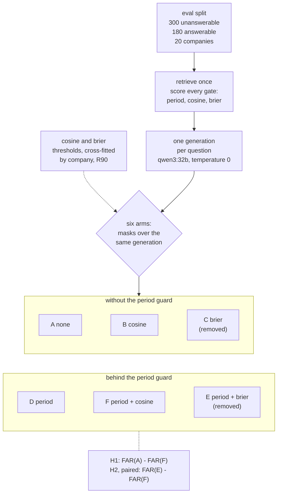
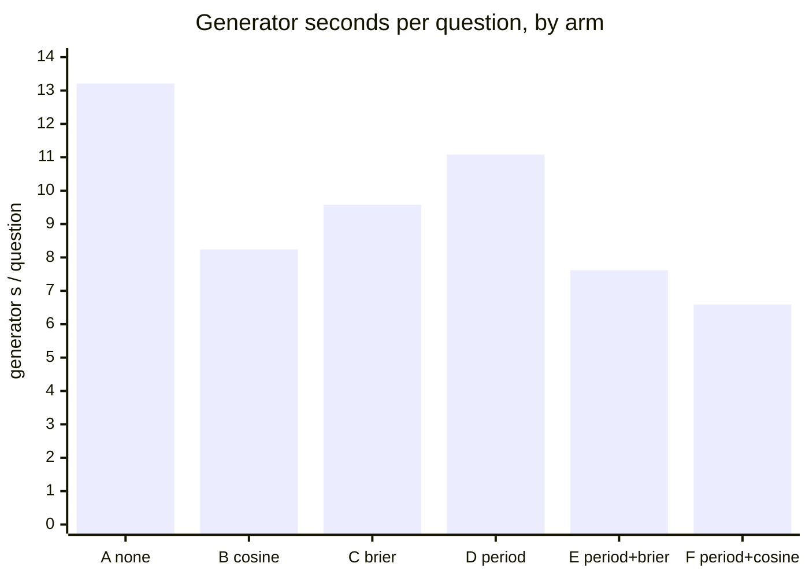
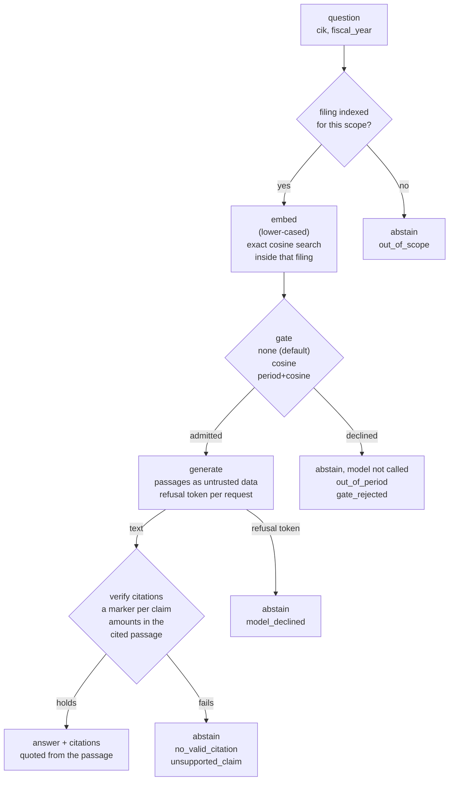
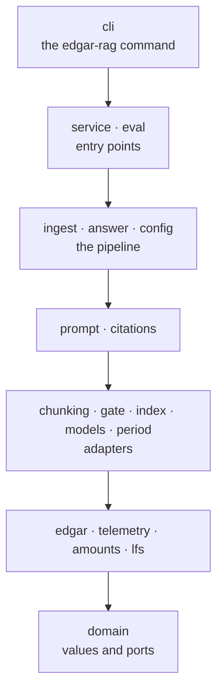

# edgar-rag

Question answering over SEC 10-K filings that cites the passage it used and
declines when the filing does not support an answer.

[](https://github.com/Rodrigo-Palma/edgar-rag/actions/workflows/ci.yml)
[](https://github.com/Rodrigo-Palma/edgar-rag/releases)

[](LICENSE)

The outcome, in the sentence the [protocol](docs/eval/protocol.md) fixed
before the run ([addendum](docs/eval/report-v1-addendum.md)):

> With no gate, the model answered 13 of 300 unanswerable questions (FAR 4.3%,
> Wilson 95% [2.5%, 7.3%]). No pre-generation gate can remove more false
> answers than the model gives, so H1 was not attainable on this set. What the
> gate changes is cost: arm F spends 6.59 generator seconds per question
> against 13.21 for arm A, at a recall cost of 0.6% [99% interval +0.0 to
> +2.2 p.p.].

So the service ships with no gate, H2 was not met, and the relevance model it
started from ([brier](https://github.com/Rodrigo-Palma/brier), archived) was removed
([ADR-0014](docs/adr/0014-remove-brier-default-to-no-gate.md)).


Six scenes, every line the real output of the command above it: a cited
answer, a decline before the model, a decline by the model, the report
rebuilt byte for byte, the result printed from it, and the CI gate. Replayed
from recorded tapes with no model and no network; the index, search, gate and
citation check run for real ([source](docs/media/demo.tape); `ask` is a POST
to `/ask` defined in [scripts/demo_tour.sh](scripts/demo_tour.sh)).

[Result](#result) · [Try it](#try-it) · [How it works](#how-it-works) ·
[Guarantees](#guarantees-and-the-test-that-enforces-each) ·
[Evaluation](#evaluation) · [What failed](#what-failed-and-why) ·
[Running it](#running-it) · [Limitations](#limitations)

## Result



An arm decides only whether the shared generation is kept, so every difference
between arms is a difference in the gate
([ADR-0015](docs/adr/0015-one-generation-serves-every-arm.md)). False answers
are answers to the 300 unanswerable questions; recall cost is the share of the
180 answerable questions arm A answers correctly and the arm declines.

| arm | false answers on unanswerable (n=300), Wilson 95% | company bootstrap 95% | recall cost (n=180), Wilson 95% | generator s / question |
|---|---|---|---|---|
| A no gate, model refusal only (**default**) | 13/300 = 4.3% [2.5%, 7.3%] | [2.3%, 6.7%] | 0/180 = 0.0% [0.0%, 2.1%] | 13.21 |
| B cosine | 3/300 = 1.0% [0.3%, 2.9%] | [0.0%, 2.3%] | 1/180 = 0.6% [0.1%, 3.1%] | 8.24 |
| C relevance model (brier, removed) | 5/300 = 1.7% [0.7%, 3.8%] | [0.0%, 3.7%] | 3/180 = 1.7% [0.6%, 4.8%] | 9.58 |
| D period guard | 13/300 = 4.3% [2.5%, 7.3%] | [2.3%, 6.7%] | 0/180 = 0.0% [0.0%, 2.1%] | 11.08 |
| E period guard + relevance model (removed) | 5/300 = 1.7% [0.7%, 3.8%] | [0.0%, 3.7%] | 3/180 = 1.7% [0.6%, 4.8%] | 7.62 |
| F period guard + cosine (latency option) | 3/300 = 1.0% [0.3%, 2.9%] | [0.0%, 2.3%] | 1/180 = 0.6% [0.1%, 3.1%] | 6.59 |

20 companies, 15 unanswerable and 9 answerable questions each, 40 filings
(fiscal 2024 and 2025); cosine and brier thresholds cross-fitted by company in
two folds of 10, at the score that admits 90% of the answerable questions of
the opposite fold. Generator `qwen3:32b`, `temperature=0`, on an Apple M3 Max,
2026-10-02.

The two confirmatory comparisons, copied from the
[report](docs/eval/report-v1.md) (99% company-bootstrap intervals, MDE at 80%
power beside each):

| hypothesis | estimate | 99% CI | MDE | reading |
|---|---|---|---|---|
| H1, FAR(A) - FAR(F), needs lower bound above 5 p.p. | +3.3 p.p. | [+1.3, +5.7] p.p. | about 3.0 p.p. | not attainable: arm A answers 4.3%, under the 5.0% margin |
| H1, recall cost of F, needs upper bound at most 12 p.p. | +0.6 p.p. | [+0.0, +2.2] p.p. | about 1.8 p.p. | |
| H2, FAR(E) - FAR(F), paired, needs upper bound below 0 | +0.7 p.p. | [+0.0, +2.7] p.p. | about 2.2 p.p. | not met; discordant 2 and 0, exact McNemar p = 0.500 |

A difference smaller than the MDE printed beside it is not distinguishable at
this n.



Mean generator seconds per question on the eval split, exploratory per the
addendum. False answers are in the table above and not charted: a bar cannot
show their intervals.

What follows, by the rules of section 9 written before the run:

- **The default gate is `none`.** H1 was not met, so the service asks the model
  every time and leaves the refusal to it. `period+cosine` is offered as a
  latency option: about half the generator seconds per question, at the
  recall cost above.
- **The relevance model was removed.** It ranked worse than cosine on the
  gate-only tier: AUROC(brier) - AUROC(cosine) -0.101, 95% CI [-0.124, -0.080],
  on 3076 answerable and 3076 unanswerable questions of 20 companies. Its
  frozen scores stay in the report ([ADR-0014](docs/adr/0014-remove-brier-default-to-no-gate.md)).

**What this does not show.** The 480 questions are generated from XBRL
templates; the 40 questions written by hand are reported apart
([Evaluation](#evaluation)) and never pooled. The model's refusal is
conservative as well as safe: arm A answered 48/180 = 26.7% [20.7%, 33.6%] of
the answerable questions correctly. Nothing here generalises beyond 10-K
filings of large US companies on this hardware and runtime.

## Try it

```bash
git lfs install       # once, before cloning: the CI index and tape live in Git LFS
uv sync --frozen
make demo
```

No model needed: the embeddings and generations come from the tape `qwen3:8b`
recorded over the dev split (`eval/ci/tape`), and the demo runs
`EDGAR_RAG_GATE=period+cosine`, so the second question is declined before any
model would be asked. The same requests against `make serve`
(`127.0.0.1:8000`):

```bash
curl -s localhost:8000/ask -H 'content-type: application/json' \
  -d '{"cik": 320193, "fiscal_year": 2025, "question": "How much revenue did Apple report for fiscal year 2025?"}'
curl -s localhost:8000/ask -H 'content-type: application/json' \
  -d '{"cik": 320193, "fiscal_year": 2025, "question": "What cash dividends did Apple pay to shareholders in fiscal 2020?"}'
```

<details><summary>Response: a cited answer</summary>

```json
{
  "question": "How much revenue did Apple report for fiscal year 2025?",
  "text": "Apple reported total net sales of $416,161 million for fiscal year 2025 [2].",
  "citations": [{"marker": 2, "item": "Item 8", "title": "Financial Statements and Supplementary Data",
                 "quote": "... CONSOLIDATED STATEMENTS OF OPERATIONS\n(In millions, except number of shares, ...)\nYears ended\nSeptember 27,\n2025 ...", "score": 0.7566}],
  "abstained": false,
  "reason": null,
  "detail": "the question names fiscal 2025; this filing reports fiscal 2023 to 2025; best passage scored 0.758",
  "retrieval_score": 0.7582,
  "gate_score": 0.7582,
  "degraded": false,
  "source": {"company": "Apple Inc.", "cik": 320193, "fiscal_year": 2025, "accession": "0000320193-25-000079",
             "form": "10-K", "filing_date": "2025-10-31",
             "url": "https://www.sec.gov/Archives/edgar/data/320193/000032019325000079/aapl-20250927.htm"},
  "replayed": true
}
```

</details>

<details><summary>Response: an out_of_period decline</summary>

```json
{
  "question": "What cash dividends did Apple pay to shareholders in fiscal 2020?",
  "text": null,
  "citations": [],
  "abstained": true,
  "reason": "out_of_period",
  "detail": "The question asks about a period this filing does not cover, so the model was not asked. (the question names fiscal 2020; this filing reports fiscal 2023 to 2025)",
  "retrieval_score": 0.7609,
  "gate_score": 0.7609,
  "degraded": false,
  "source": {"company": "Apple Inc.", "cik": 320193, "fiscal_year": 2025, "accession": "0000320193-25-000079",
             "form": "10-K", "filing_date": "2025-10-31",
             "url": "https://www.sec.gov/Archives/edgar/data/320193/000032019325000079/aapl-20250927.htm"},
  "replayed": true
}
```

</details>

The responses are the demo's (replay, `period+cosine`, the long quote trimmed
to `...`); a live `make serve` with the default gate asks the model both
questions, so its replies can differ. `reason` is one of `gate_rejected`,
`out_of_period`, `model_declined`, `no_valid_citation`, `unsupported_claim` or
`out_of_scope`, and `null` on an answer. `gate_score` is the relevance gate's
own score. `degraded` is true when a gate decided on part of its evidence,
which neither built-in gate does. Replay answers only the golden set's
questions as written there, and any other with `404 not recorded`. The full
schema is served at `/openapi.json`.

## How it works



Every request names the filing it is about: `cik` is required and
`fiscal_year` picks one of the company's indexed years (the latest when left
out). The search never leaves that filing. The request, participant by
participant, including the busy response when every generation slot is taken:
[docs/architecture.md](docs/architecture.md#a-request).

## Guarantees and the test that enforces each

| guarantee | enforced by |
|---|---|
| A declined question never reaches the model | [`test_abstains_before_generating_when_retrieval_is_weak`](tests/test_answer.py), [`test_a_gate_rejection_traces_no_generation`](tests/test_answerer.py) |
| The refusal token is drawn per request, and only that exact token is a refusal | [`test_one_answered_request_draws_exactly_one_nonce`](tests/test_injection.py), [`test_two_requests_to_one_answerer_carry_different_refusal_tokens`](tests/test_injection.py), [`test_only_the_exact_token_is_a_refusal`](tests/test_injection.py) |
| Filing text is untrusted: it cannot close the passages block, open a turn, fake a citation or force a refusal | [`test_a_nested_closing_tag_cannot_close_the_block`](tests/test_injection.py), [`test_a_passage_cannot_open_a_new_turn`](tests/test_injection.py), [`test_no_citation_marker_survives_in_a_passage`](tests/test_injection.py), [`test_the_refusal_phrase_is_removed_in_any_spelling`](tests/test_injection.py) |
| A sentence with a figure, in digits or in words, or a long one, cites a retrieved passage, or the answer abstains with `no_valid_citation` | [`test_a_sentence_with_a_figure_and_no_marker_abstains`](tests/test_citation_check.py), [`test_a_spelled_out_figure_needs_a_marker`](tests/test_citation_check.py), [`test_a_long_sentence_with_no_marker_abstains`](tests/test_citation_check.py) |
| Every figure in a cited sentence, in digits or in words, matches a figure the text of a cited passage prints, or the answer abstains with `unsupported_claim`. The item label and the passage's references to notes, pages, exhibits and sections back nothing, a percentage is backed only by a percentage, and a number printed without a scale word is rescaled only with 3 or more significant digits | [`test_a_figure_the_cited_passage_does_not_contain_abstains`](tests/test_citation_check.py), [`test_an_injected_figure_cited_to_a_legitimate_passage_abstains`](tests/test_citation_check.py), [`test_a_reference_number_does_not_back_a_figure`](tests/test_citation_check.py), [`test_a_spelled_out_figure_the_cited_passage_does_not_contain_abstains`](tests/test_citation_check.py), [`test_a_number_of_another_kind_or_too_short_to_scale_does_not_back_a_figure`](tests/test_citation_check.py) |
| An abstention names the sentence that failed, never the figure it withheld | [`test_the_withheld_figure_appears_nowhere_in_the_ask_response`](tests/test_api.py) |
| A search never returns a passage of another filing | [`test_a_search_never_returns_a_passage_of_another_filing`](tests/test_corpus_index.py), [`test_a_question_is_never_answered_from_another_company_s_filing`](tests/test_answerer.py) |
| The service refuses an index built by another embedder, or a shard changed after it was written | [`test_the_service_refuses_to_start_on_an_index_from_another_embedder`](tests/test_api.py), [`test_the_service_refuses_to_start_on_a_shard_that_changed`](tests/test_api.py) |
| A gate that decided on part of its evidence is reported as `degraded`, up to the HTTP response | [`test_a_degraded_gate_is_reported_on_an_answer`](tests/test_answer_contract.py), [`test_a_partly_judged_refusal_reaches_the_client_as_degraded`](tests/test_api.py) |
| The period guard never declines a year the filing reports | [`test_a_question_in_a_reported_year_is_never_declined`](tests/test_period.py) (property test) |
| The JSON above is the shape the service returns | [`tests/test_readme_contract.py`](tests/test_readme_contract.py) |
| Every number in this README, its diagrams included, is copied from the evaluation reports | [`scripts/check_readme_numbers.py`](scripts/check_readme_numbers.py), run by `make check` and [`tests/test_readme_numbers.py`](tests/test_readme_numbers.py) |
| The report is what the frozen run produces | CI job "report reproduces": `make eval` leaves `docs/eval/` unchanged |
| No test reaches the network or a model | [`no_network`](tests/conftest.py), an autouse fixture that fails any request through httpx's sync or async transport and any `socket.connect` to an internet address: [`test_an_async_httpx_request_to_an_external_host_fails`](tests/test_no_network.py), [`test_a_raw_socket_connect_fails`](tests/test_no_network.py) |

What the citation check does not verify is in [Limitations](#limitations).

## Evaluation

[Protocol](docs/eval/protocol.md) (written and committed before the run) ·
[report](docs/eval/report-v1.md) (regenerated by `make eval`) ·
[addendum](docs/eval/report-v1-addendum.md) (headline sentence, and which
parts are confirmatory) · [deviations](docs/eval/deviations-v1.md).
Everything in this section is exploratory or descriptive, per the addendum;
the full tables are in the report.

- **The model errs where the question is about another company:**
  `other_company` false answers 9/75 = 12.0% [6.4%, 21.3%] under arm A, 1/75 =
  1.3% [0.2%, 7.2%] under arm F.
- **Gate only, every golden question of the eval split:** AUROC cosine 0.834
  [0.820, 0.849] against brier 0.732 [0.713, 0.755].
- **Risk against coverage, end to end:** AURC 0.372 for brier against 0.418
  for cosine (lower is better); exploratory and not part of the brier rule.
- **Narratives written by hand, never pooled:** the correct decision under arm
  A on 36/40 = 90.0% [76.9%, 96.0%]; the expected `Item` cited on 10/12 = 83.3%
  [55.2%, 95.3%] of the answered ones whose filing passes the split rule.
- **Determinism:** the same prompt sent twice gave identical text in 30/30 =
  100.0% [88.6%, 100.0%].

**v1.1 changes the citation check, not the gate.** The numbers above were
measured with the v1.0.0 check. Replayed over the same 139 generations with
text, with no model ([protocol](docs/eval/protocol-v1.1.md), written first;
[report](docs/eval/report-v1.1-citations.md), rebuilt by `make eval`), the
v1.1 check changes no outcome: under arm A, 0/117 answers are withheld once
reference numbers stop counting, 0/117 state their figures only in words, and
0/22 withheld answers would be answered. Zero here means at most 3.2% of
answers (Wilson 95%), not none. The replay can see a wrong figure: moving one
digit in each answer is withheld in 102/105.

## What failed and why

**Wrong-year questions.** A relevance score cannot see a year: cosine and the
relevance model both admitted questions about another year in the first
prototype. `PeriodGuard` (`src/edgar_rag/period.py`) declines a year the filing
does not report; on the headline run the model refused all of them itself
(arm A, 0/75), so the guard bought nothing there.

**The embedder discarded every proper noun.** On Ollama `0.18.0` with
`nomic-embed-text` a capitalised token collapses onto one vector
([ollama/ollama#15609](https://github.com/ollama/ollama/issues/15609)). Every
text is lower-cased before embedding, and the flag is part of the index
fingerprint ([ADR-0003](docs/adr/0003-lowercase-embedding-input.md)).

**The section split is noisy.** `split_into_sections` mislabels some filings,
so the one metric that depends on the label is reported only on filings that
pass a mechanical rule fixed before the run; it fails 15 of the 48 filings,
which is why that metric stands on 10/12. No headline number depends on it
([protocol](docs/eval/protocol.md), section 11, D-02).

**Two companies left the roster.** XOM and HD failed the roster rule and were
replaced by LLY and PEP from the reserve list, in order, before any
generation. Energy is left with CVX alone; no hypothesis is by sector
([protocol](docs/eval/protocol.md), section 11, D-01).

**The relevance model lost.** [brier](https://github.com/Rodrigo-Palma/brier) (code at
[`d70e7df`](https://github.com/Rodrigo-Palma/brier/tree/d70e7df9b0b4f765e2d533c7bc9dd532155916e5)) ranked worse than cosine on the gate-only
tier and did not beat it behind the guard (H2 not met). By the rule fixed
before the run it was removed; its scores stay published in the report
([ADR-0014](docs/adr/0014-remove-brier-default-to-no-gate.md)).

## Operating it

Per stage, over the 6192 cases of the headline run (the gate stage scored the
period guard, cosine and brier together):

| stage | n | P50 s | P95 s |
|---|---|---|---|
| embed | 6192 | 0.016 | 0.029 |
| search | 6192 | 0.000 | 0.000 |
| gate | 6192 | 0.213 | 0.249 |
| generate | 520 | 12.913 | 19.412 |

A decline costs nearly as much as an answer when the model is the one that
declines; a gate decline costs the embedding, the search and the gate.
Limits, the log line, `/health`, tokens per outcome, the container and the
run's tape: [docs/operations.md](docs/operations.md).

## Running it

From a clone, with no model and no network:

```bash
git lfs install                  # once, before cloning
uv sync --frozen                 # runtime and dev tools, as locked in uv.lock
make check                       # lint, types, import contracts, tests, README numbers
make eval                        # rebuilds docs/eval/ from the frozen run
git status --porcelain docs/eval # empty: the report reproduces
make eval-ci                     # replays the dev split against the CI baseline
make demo                        # one cited answer, one decline
make result                      # the six arms and the H1/H2 reading, printed from the report
```

With a model (Ollama on the host):

```bash
cp .env.example .env             # a real SEC contact is needed only to download a new filing
ollama pull nomic-embed-text && ollama pull qwen3:32b
make ingest                      # the 48 pinned filings, from the committed snapshots
make serve                       # 127.0.0.1:8000, default gate none
EDGAR_RAG_GATE=period+cosine make serve   # the latency option
make cosine-threshold            # prints the default cosine threshold and how it was fitted
```

Every pull request runs `make eval-ci`: the dev split replayed from the tape,
each case judged right or wrong under each arm against `eval/ci/baseline.json`,
failing on a net worsening of 3 or more cases in any group. Replay is
deterministic, so a case that changed did so because the code did.
[Pull request #4](https://github.com/Rodrigo-Palma/edgar-rag/pull/4), closed
unmerged, is that gate rejecting a one-line change to the period guard that
every unit test accepted.

**Why there is no hosted instance.** The configuration the numbers describe
needs a 32B model on a GPU, and a smaller hosted model would be another system
than the one measured. The replay demo and the container stand in for it
([ADR-0016](docs/adr/0016-local-only-no-hosted-instance.md)).

## Design



A module imports only from layers below its own, and modules in one box do not
import each other. The answering core (answer, prompt, citations) reaches the
adapters only through the ports in domain, and the evaluation statistics
import no I/O, model or service. `make imports` fails the build on any of the
three. The module table and a request participant by participant:
[docs/architecture.md](docs/architecture.md).

Sixteen decisions in [docs/adr](docs/adr/README.md); the ones the result rests
on are [ADR-0001](docs/adr/0001-abstain-before-generating.md),
[ADR-0008](docs/adr/0008-eval-runs-the-production-pipeline.md),
[ADR-0014](docs/adr/0014-remove-brier-default-to-no-gate.md) and
[ADR-0015](docs/adr/0015-one-generation-serves-every-arm.md).

## Limitations

- The questions are generated from XBRL templates; the 40 narratives are the
  only hand-written check, and they are few.
- The generator may have seen these filings in pre-training. Fiscal 2024 and
  2025 filings, and the requirement that the cited passage print the gold
  value, limit that risk and do not remove it.
- Twenty companies are few clusters: the company-bootstrap intervals
  undercover, which is why the confirmatory ones are 99% nominal, and Wilson
  intervals assume independent questions.
- Measured once, on an Apple M3 Max with Ollama `0.18.0`, on 2026-10-02.
  Latency on other hardware will differ.
- The default cosine threshold was fitted after the report, in sample; the
  F row above was measured at the cross-fitted thresholds
  ([ADR-0014](docs/adr/0014-remove-brier-default-to-no-gate.md)).
- Local only: no hosted instance, no authentication, no rate limit.
- The period guard reads any year a question names as the period asked
  about, including one inside a proper noun: under `period+cosine`, a question
  about the `2021 Stock Plan` at the end of fiscal 2025 is declined as
  `out_of_period`. The default gate, `none`, does not run the guard.
  [`test_a_year_that_names_a_plan_is_not_a_period`](tests/test_period.py)
  records it as an expected failure.
- The citation check is lexical. It holds every figure of a cited sentence
  to the text of the passage it cites, and nothing more: wording without
  figures can still paraphrase wrongly, and a figure the model computed (a
  growth rate the passage does not print) is withheld even when it is right.
  It reads a figure in words only when it names a scale, `percent` or
  `dollars` (`ninety billion dollars`, not `two segments`). In the v1 run the
  weaker v1.0.0 check, which also counted the item label and note and page
  numbers as support, decided no outcome differently: 0/117 under arm A, at
  most 3.2% (Wilson 95%)
  ([report](docs/eval/report-v1.1-citations.md)).

## License

[MIT](LICENSE)
