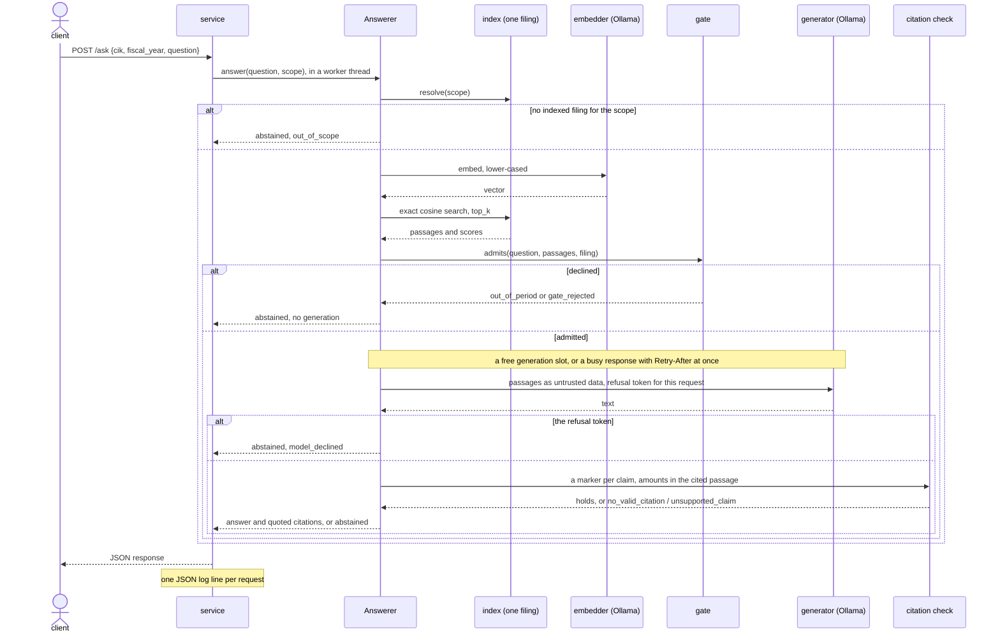

# Architecture

How a request moves through the service, and where each module sits. The
decisions behind both are in [docs/adr](adr/README.md); the layers are the
contract `make imports` holds in `pyproject.toml`.

## A request

Participant by participant, including where a question leaves without
reaching the generator:

The generation slot is taken by the generator the service wraps around the
model (`GenerationSlots` in `src/edgar_rag/service/app.py`), so a question the
gate declines never waits for one. The limits, the log line and the error
responses are in [operations](operations.md).

## Modules

| path | what lives there |
|---|---|
| `src/edgar_rag/cli.py` | the `edgar-rag` command: `ingest`, `serve`, `eval` |
| `src/edgar_rag/service/` | the service: composition at startup, limits, the JSON contract, error mapping |
| `src/edgar_rag/eval/` | the evaluation: golden set, harness, tapes and replay, the CI gate, statistics |
| `src/edgar_rag/ingest.py` | a filing into a shard of the index: parse, chunk, embed in batches |
| `src/edgar_rag/answer.py` | the `Answerer`: retrieve, gate, generate, check the citations, or abstain |
| `src/edgar_rag/config.py` | settings for the service, the ingestion and the evaluation |
| `src/edgar_rag/prompt.py` | the generation prompt and the untrusted-text guard |
| `src/edgar_rag/citations.py` | which passages an answer cites, whether each sentence is backed by them, the quote shown |
| `src/edgar_rag/chunking.py` | sections into passages, cut on sentence boundaries |
| `src/edgar_rag/gate.py` | the relevance gates (cosine, none) and `AllOf`, which composes gates |
| `src/edgar_rag/period.py` | the period guard: the years a question names against the years the filing reports |
| `src/edgar_rag/index.py` | the index: one shard per filing, the manifest and its checks, scoped cosine search |
| `src/edgar_rag/models.py` | Ollama embedding and generation, lower-cased and pinned |
| `src/edgar_rag/edgar/` | EDGAR client, XBRL facts and the 10-K parser |
| `src/edgar_rag/amounts.py` | amounts as a filing writes them, shared by the evaluation and the citation check |
| `src/edgar_rag/telemetry.py` | per-stage timing and the one JSON line per request |
| `src/edgar_rag/domain.py` | the values the pipeline passes around, and the ports it calls |
| `eval/` | roster, pinned filings, snapshots, golden set, CI index, tape and baseline, frozen runs |
| `docs/eval/` | protocol, report, addendum, deviations |

The table runs top to bottom in import order: a module imports only from rows
below its own layer, and the answering core reaches the models, the gate and
the index only through the ports in `domain.py`. `make imports` enforces both.
